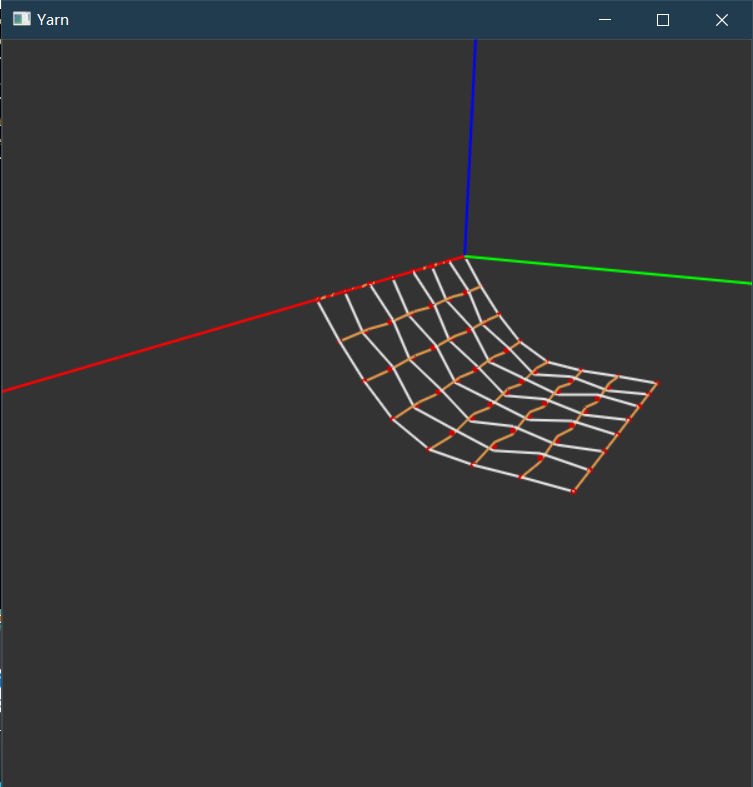

# Yarn-cloth-sim

### Current result

I have implemented all the forces mentioned in the paper, and got the following result.

This animation seems right but not robust as time steps increase.

Also, as for the cases when pinned from two corners, it doesn't converge and sometimes crash :(

I think maybe because I have not added boundary condition and just do it through clamping the position and velocity. Also, I think the energy formula mentioned in the paper is kind of strange. I don't know how to calculate the stiffness matrix for the friction. 

It is damn hard!