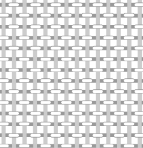
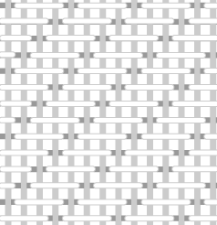
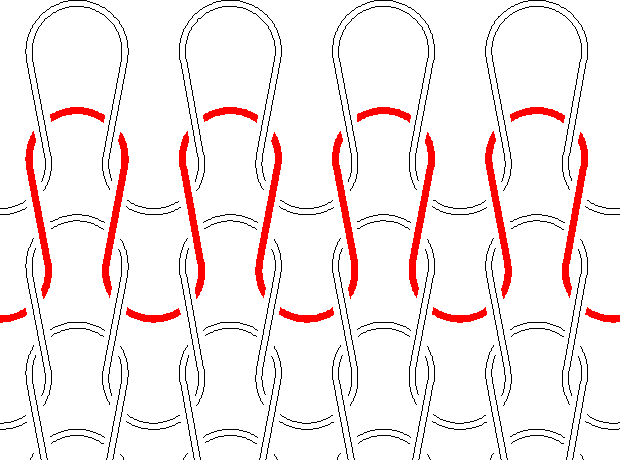
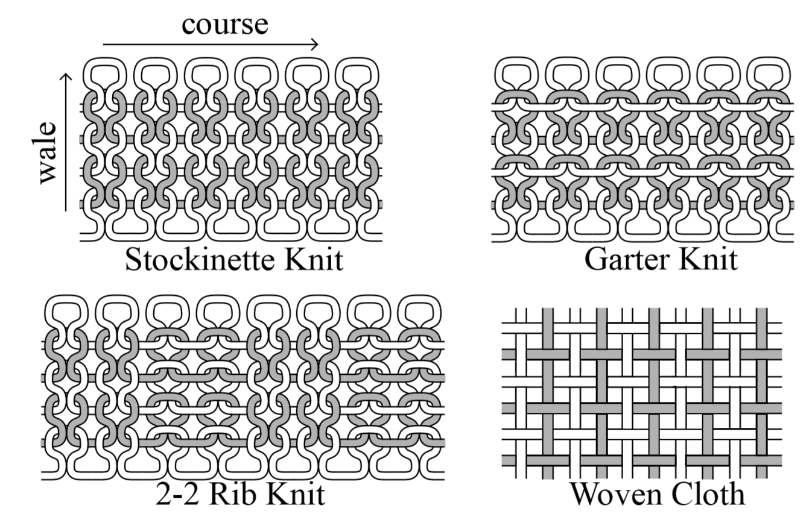
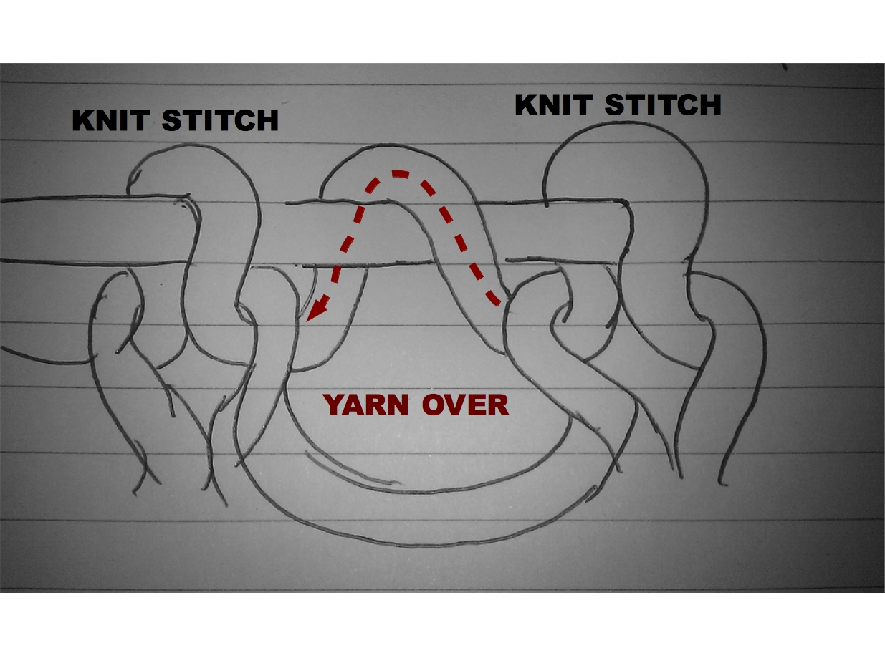
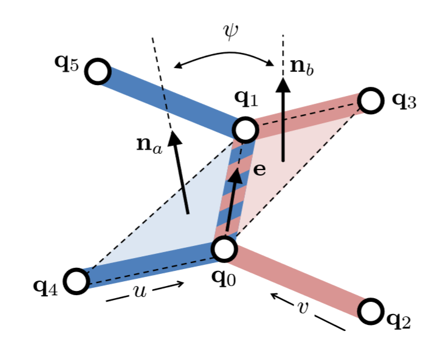
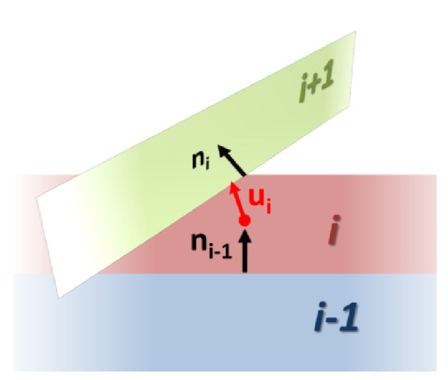

## Yarn Level Cloth Simulation

### 1. Introduction to Yarn Cloth
基于纺线的布料模拟可以分为两种：woven cloth和knitting cloth。 
#### 1.1 woven cloth
对于woven cloth来说，纺线可以分为经线与纬线。经纬线之间用交叉关系相互连接。如果不论经线纬线均是相邻交错互相覆盖，则称为plain weave，如果是经线/纬线每隔几根另一根线才发生交错，则称为twill，其中间隔的纺线数称为float。float的大小决定了布料的最终物理性质。float越大，其抗剪应力越强，在自然下垂是产生的褶皱也就越少。float越小，可以理解为自由度越多，在自然下垂时产生的褶皱越多。（如下，左图为plain weave，右图为twill。）

   &nbsp &nbsp  

#### 1.2 knitting cloth
对于knitting cloth来说，和woven一样，knitting也是由两组线交叉编织得到的。但是woven里经纬线的方向都是笔直且正交的，然而knitting里线的方向是弯曲的。如下图所示

红色的线挂在上面的白线上，下面的白线挂在红线上。红色的线的方向称为course direction，一个纺线序列，其中每一根纺线都挂在另一条纺线上，此方向称为wale direction。在上图中，可以认为水平蜿蜒的方向为course，数值的并列排布方向为wale。

##### knit geometry
对于knitting cloth来说，每根纺线可以看作是由一系列的loop构成。不同纺线的loop之间通过stitch（针脚）相连接。针脚可以分为两类，knit stitch和purl stitch，相当于一张纸的正反两面。同样如上图所示，红线悬挂在白线上，从图片视角看，最上面的红线呈现出“V”字型，即为knit stitch。相反，如果从图片的反面看过去，最上面的红线呈现出“一”字型，即为purl stitch。因为针脚的不对称性，所以会造成正反面针脚形状的不同。

上文已经介绍了knit stitch和purl stitch，其不同的组合排列方式会使得布料整体具有不同的物理性质。根据stitch排列方式的不同，可以分为三种最为常见的布料：stockinette(all "knit" stitches), garter(alternating rows of "knits" and "purls")，2-2 rib(each row consists of repetitions of 2 "knit" stitches followed by 2 "purl" stitches).结构示意图如下：

garter是最简单的排列类型，因为它knit与purl隔行交错，不分正反面，因此静止状态下不会有大的自身弯曲。而stockinette因为一面全是knit，另一面全是purl，因此在自然状态下于纺线的边缘会发生较大的弯曲。而rib则会在course方向比之前两种布料都要短，同时自然条件下边缘处也会有些许弯曲。

关于**yarn-over stitch**(YO-stitch)，一条纺线在当前的loop上并没有悬挂到之前的一行纺线，相当于这两条相邻纺线的两个对应loop都没有纺到一起，于是可以在编织物中形成一个洞。示意图如下：

关于**increases**和**decrease**，说实话这俩针脚的类型我并没有在网上找到能看懂的示意图......不过可以确定的是二者都是结合了purl、knit和YO-stitch，increase能够使得当前纺线上的针脚增多，decrease能够使得当前纺线上的针脚数量减少。

### 2. Yarn Discretization
如果单纯地将纺线布料模拟看作是完全模拟每根纺线的运动的话，则除了大量的弹性杆自身运动需要考虑以外，还需要考虑运算量更大更复杂的纺线间碰撞以及自碰撞，因此，必须对纺线的布料模型进行简化。下面主要讲述TVCG 2016的Yarn-Level Cloth Simulation with Sliding Persistent Contacts中广义地适用于woven cloth和knitting cloth的离散模型。

#### 2.1 Structure of Yarn-Based Fabrics
关于针脚的几何形状在第一节中已经介绍过了。不论是woven还是knitting cloth的纺线都会受到相当复杂的力的作用，包括防线自身形变产生的力以及纺线间接触所产生的弯曲、扭转、拉伸、摩擦等力。当然，宏观上的布料属性主要是由纺线间的力作用决定的。纺线间的力主要包含三个方面：在woven的cross处或者knitting cloth的stitch处；相邻纺线之间的接触或者相邻loop之间的接触；纺线滑动或者切变的摩擦力。对于woven来说，因为纺线几乎都是笔直编织的，因此拉伸形变并不明显。主要是其纺线之间的作用力决定。而对于knitted cloth，针脚的几何形状将会有比较大的影响，同时由于纺线在编织时就发生了弯曲，因此纺线自身的弯曲力、剪切力、纺线间作用力等都会有较大影响。当处于自然状态下，一些knitted cloth本身就会产生一些形变，比如stockinette会在纺线两端发生卷曲，rib会在每条棱上发生卷曲等。

#### 2.2 Discretization using contact nodes
对于n条纺线的接触点，定义$\boldsymbol{q}=(\boldsymbol{x},u_1,...,u_n)$，包含了3+n个自由度。其中$\boldsymbol{x}$是该接触点的空间坐标，$u_i$表示该点在n条纺线上的欧拉坐标。

##### 2.2.1 Yarn Crossings in Woven Cloth
woven cloth是最简单的离散情况，每一个交叉点可以抽象为一个包含5个自由度的contact node。

##### 2.2.3 Two-Yarn Stitches in Knitted Cloth
对于两根纺线的stitch，例如下图中的purl和knit stitch，每根纺线上的loop都会与上一根纺线的loop发生编织操作，形成两个stitch。同时，在实际使用中，只要纺线没有被拆散，两条纺线所形成的stitch相对位置几乎不会发生大的变化。基于此，可以将每一个stitch抽象为两个5-DOF contact node所组成的一个segment。这样做的好处是该segment可以描述loop诸如拉伸的形变，而使用单个contact node则会缺失自由度。对于每一个knit/purl stitch，会有上下一共四个stitch contact，也就是说有8个contact node。所以对于有N个loop的布料来说，可以粗略估计大概有4N个contact node和20N个自由度。

##### 2.2.4 Stacked stitches in knitted cloth
对于decrease，多个loop可能会被放在一个stitch里，此使仍然将包含n条纺线的stitch抽象为两个contact node形成的segment。每一个contact node将会有3+n个自由度。纺线间的相互作用力两两之间进行计算。

### 3. Force Model
模型的力包含以下几个部分：
+ 重力
+ 纺线自身的弹性力
+ 纺线间的接触力
+ 摩擦力
+ 粘滞力

#### 3.1 Yarn Bending
给定两个连续的纺线segment，其弹性势能为
$$
V=k_b \frac{\theta^2}{\Delta u}
$$
其中$\theta$是相邻两个segment的夹角，$k_b=B\pi R^2$，B是弹性模量，R是纺线半径，$\Delta u=u_1-u_2$。

对于较大的$\theta$，当发生了shear jamming之后，为了描述bending jamming的现象，当$\theta$超过了某个阈值之后逐渐以三个数量级的速度增大B。（在论文中阈值为$\frac{\pi}{2}$）

对于用户的输入来说，由于某些布料本身的编织特点，自然状态下布料会发生自身弯曲。对于复杂的布料来说，取最小的一块矩形，在无重力下模拟该方布料直至达到平衡。平衡之后，将该单元的布料重复赋值给整个布料的初始化。总的来说，就是初始化时要考虑布料自身的弯曲特性，初始化的状态可能并不是静止稳态，需要做补偿。

#### 3.2 Stitch Wrapping
对于每一个stitch，其wrapping都会产生一个形变能量，且这个形变能量是由纺线之间的相互作用得到的，与弯曲无关。通过一个二面角的大小来衡量wrap的程度以及wrap力的大小。如图所示：

 

定义wrapping angle $\phi$等于中轴和两个相对纺线segment所形成平面所夹的二面角。能量为$V=\frac{1}{2}k_wL(\phi-\phi_0)^2$。其中$k_w$为劲度系数，L是$q_0$和$q_1$之间的长度，$\phi_0$为$\frac{\pi}{2}$。纺线自身天然具有unwrap的倾向。

#### 3.3 Yarn Contact Compression
对于接触力，对于一个contact node来讲，假设这个node处有n个节点互相碰撞，如图所示：

 

则对于中间的纺线i来说，其受到来自i-1的的压力$n_{i-1}$，同时给予i+1以压力$n_i$，将相邻两根纺线的受力方向平均，得到该纺线的压力方向u。其模长为$f_i=\boldsymbol{u}_i^T(\boldsymbol{F}_i+\lambda_{i-1}\boldsymbol{n}_{i-1}-\lambda_{i}\boldsymbol{n}_i)$。对于woven来说，F只需要考虑bending force和stretch force，对于knitted cloth来说，还需要考虑wrapping force。 在绘制的时候，将contact node沿着各个normal的方向做平移，就可以将纺线分离开。

关于$\lambda$的计算，将所有的纺线状态写入一个总体矩阵。即可得到$\boldsymbol{f}=\boldsymbol{A}\lambda+\boldsymbol{b}$。因为论文中的contact node 并不包含法向量的信息，所以只能依靠一个最优化来估算contact force。 $\lambda=arg min \frac{1}{2} \boldsymbol{f}^T\boldsymbol{f}$。即有：
$$
\lambda=(\boldsymbol{A}^T\boldsymbol{A})^{-1}\cdot max(0,-\boldsymbol{A}^T \boldsymbol{b}).
$$

#### 3.4 Sliding Friction
定义摩擦力如下：
$$
F_{u_0}=\left\{\begin{aligned} 
&-k_f(u_0-\bar{u_0})-d_f \dot{u_0} \quad stick\\
&-sign(u_0-\bar{u_0})\mu F_n-d_f \dot{u_0} \quad slip
\end{aligned} \right.
$$
即以接触点和相邻点的距离作为恢复力大小的衡量标准，与弹簧力类似。stick时为静摩擦力，slip时为动摩擦力。

#### 3.5 Length of Stitch Contacts
当一个stitch segment的一端滑动时，另一端也需要做相应的滑动。即保持stitch segment的长度要尽量不变，因此使用一个罚函数能量来做这个约束。
$$
V=\frac{1}{2}k_l L (\frac{l}{L}-1)^2
$$

#### 3.6 Stretch
$$
V=\frac{1}{2}k_s\Delta u (||\boldsymbol{w}-1||)^2
$$
其中$k_s=Y\pi R^2$为弹性系数，该能量的定义与Cosserat Rod类似。
#### 3.7 Shear
？

#### 3.8 Contact between parallel yarns 
$$
V=\left\{\begin{aligned}
& \frac{1}{2}k_cL(u_1-u_0-d)^2 \quad u_1-u_0 < d \\
& 0 \quad u_1-u_0 \geq d
 \end{aligned} \right.
$$
与一般的接触力类似，当刺穿时会有一个非常大的反应力将其推回。
